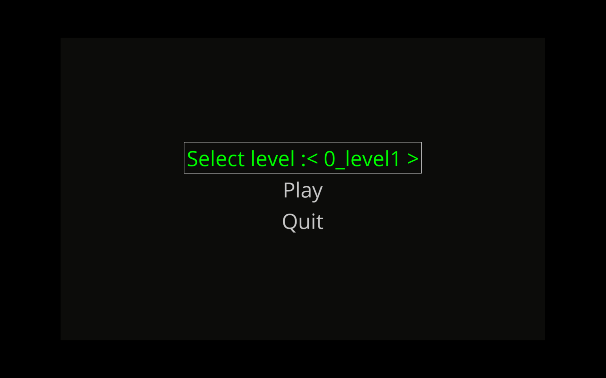
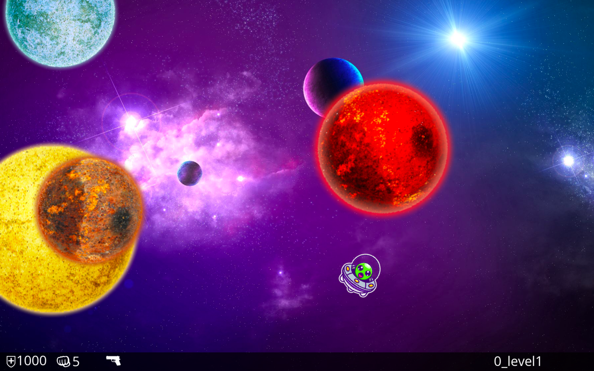
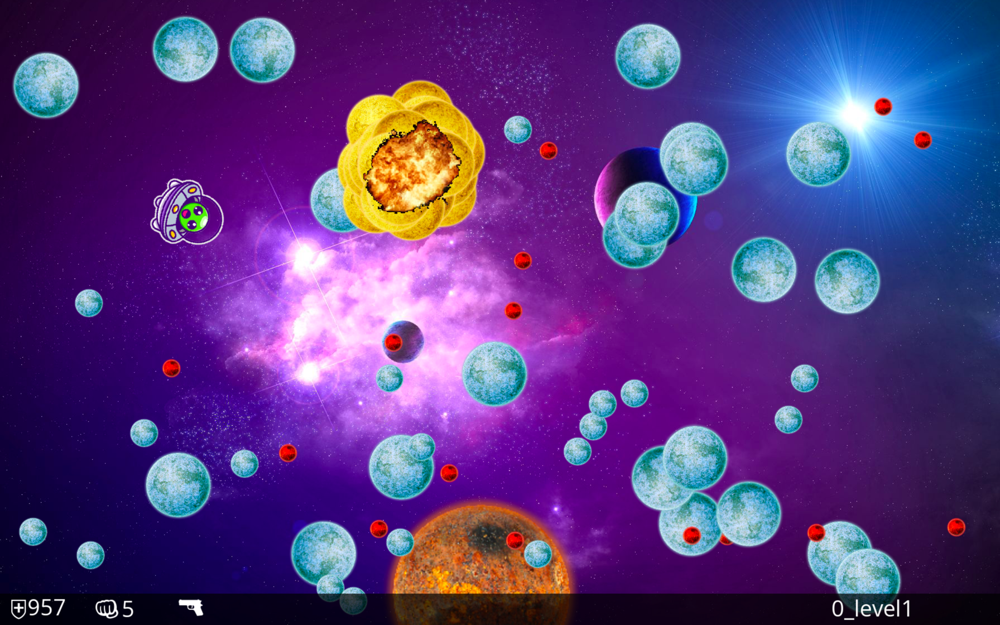
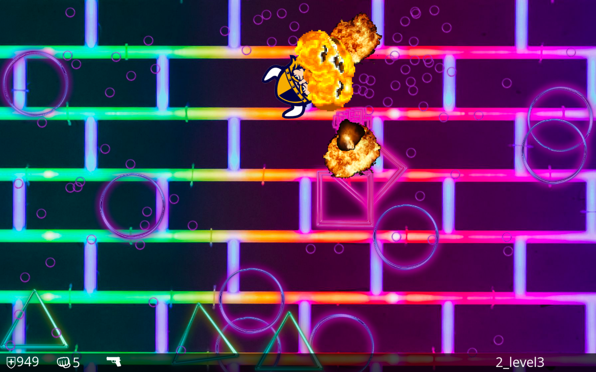
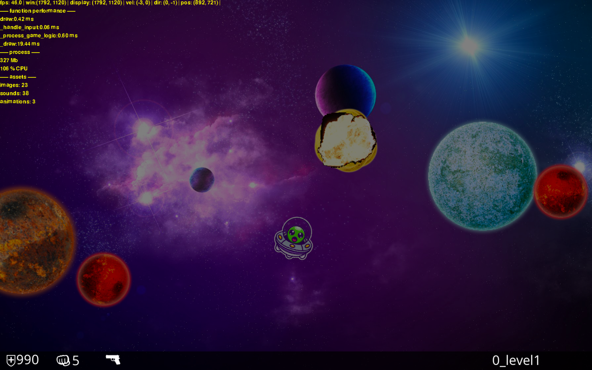

# 2D arcade-style game in Python

This game is based on this tutorial https://realpython.com/asteroids-game-python/ 
and expanded into something bigger. The primary goal was never to make a fun game, 
although that is nice to have too. This is about learning python and python tools by building something 
small-to-midsized. Thanks to the pygame community, and the gamedev community for the assets!

## Run

* $ pip install -r requirements.txt
* $ python main.py

## Demo

## Controls

* Left/A: rotate left  
* Right/D: rotate right  
* Up/A: accelerate  
* Space: fire   
* 1: switch between primary and secondary weapon
* Q: show debug info
* 7: start previous level
* 8: restart current level
* 9: start next level

## Features

### level editor
A level is any subfolder of the folder called **levels** and a level is defined in a file called `.json`.
A level must have these folders: **sounds** , **sprites** , **anim**.
The `.json` file points to assets in those folders.

### animations
Animations are based on sprite sheets. The `.json` in the "anim" folder
defines properties for each animation

### fallback assets and missing assets
The **assets** folder contains non level specific assets. 
If a level asset is not found in the level specific folder, a default dummy asset will be used instead.

### hot reload
Any file change in a level folder will reload the current level. 
This is done to make the game testing loop faster.

### other
* useful debugging views and function timers
* vsync where available
* steady 60 fps, sometimes :)

## Future improvements:
* GUI for level editor
* pixel perfect collision detection
* autogenerated levels
* improve window resizing

## Dependencies	
see [requirements.txt](requirements.txt)

## Contribution

Feel free to contribute or copy in any way